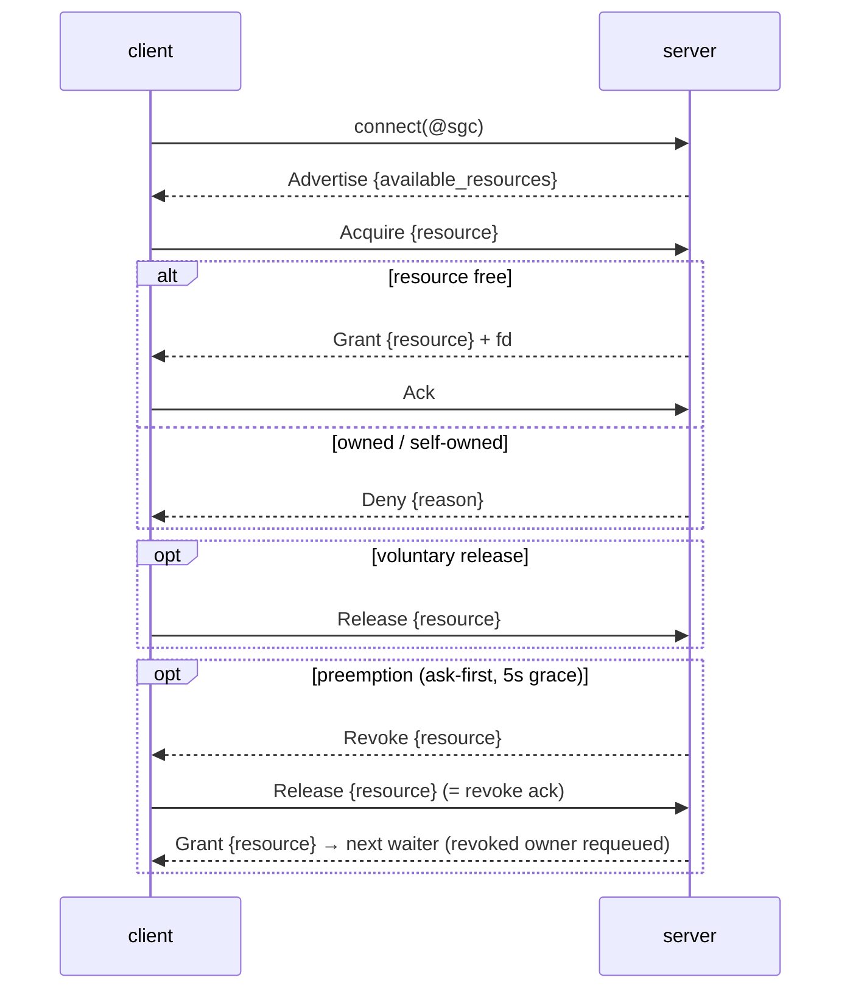
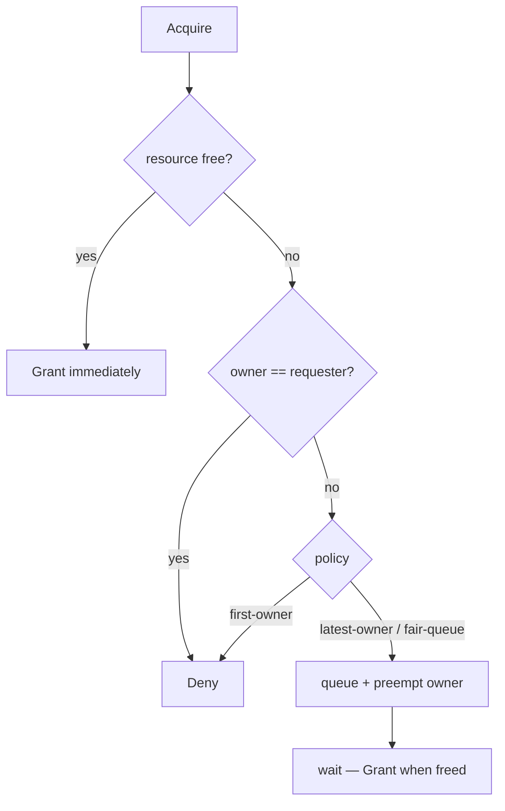

# Protocol specification

Wire contract between the simple-graphics-controller daemon (server) and its
clients. Reference for implementing clients in any language (C client:
`libsgc-c`; the canonical Rust implementation: `libsgc-rs`).

## Transport

- Unix **stream** socket, **abstract** address `@sgc` (`sun_path[0]=0`,
  then `"sgc"`; addrlen = `offsetof(sockaddr_un, sun_path) + 1 + 3`).
- Payloads: **MessagePack** (`rmp_serde`, `write_named`) — self-describing,
  no integer tags:
  - enum = one-entry map `{variant: payload}`
  - struct = one-entry map `{field: value}`
  - **unit variant = bare string** (`"Ack"`, `"Fbdev"`)
- Framing: **4-byte big-endian u32 length** header per payload (≤ 1 MiB);
  read 4 bytes then exactly N.
- Fds: **SCM_RIGHTS** out-of-band. Only `Grant` carries fds — exactly one,
  for the granted resource.

## Message flow

- Server sends `Advertise` immediately on connect (no hello).
- Every message names **exactly one resource**; multi-resource clients
  acquire one at a time.
- A **queued** Acquire gets no reply — `Grant` arrives when the resource
  frees. A `Grant` with no preceding `Acquire` = re-grant after preemption;
  keep reading after `Release`.
- Revoke is an **ask**: the owner keeps a valid fd (DRM: valid lease) for the
  grace window (`REVOKE_TIMEOUT` 5s) to finish a frame, then answers
  `Release`. On timeout the server force-reclaims (DRM: kernel-enforced lease
  revoke; fbdev/input: cooperative).
- `Grant` → server waits ≤5s for `Ack` (delivery signal; missing Ack only
  logs — it never gates the queue).

## Acquire arbitration (`SGC_POLICY`)

## Messages

### Resource

| variant | fields | wire (decoded) |
| --- | --- | --- |
| `Fbdev` | — | `"Fbdev"` |
| `Drm` | `card: u8` | `{"Drm": {"card": 0}}` |
| `Input(InputResource)` | — | `{"Input": {"Mouse": 0}}` |

`InputResource = Mouse(u8) | Keyboard(u8) | Touch(u8)` (index = device of
that class). Sources:

| kind | source | feature |
| --- | --- | --- |
| Fbdev | `/dev/fb0` | `fbdev` (opt-in) |
| Drm | `/dev/dri/cardN` with a display connector (renderDNN never) | `drm` (default) |
| Input | `/dev/input/event*`, classified touch > mouse > keyboard | `input` (default) |

`Advertise` lists DRM cards in priority order (connected connector first,
then lowest index) — first `Drm` = best display card. The granted fd is a
DRM **lease**, never the master fd.

Wire hex (payload bytes):

| resource | hex |
| --- | --- |
| `Fbdev` | `a5 46 62 64 65 76` |
| `Drm{0}` | `81 a3 44 72 6d 81 a4 63 61 72 64 00` |
| `Input(Mouse(1))` | `81 a5 49 6e 70 75 74 81 a5 4d 6f 75 73 65 01` |

### ClientRequest (client → server)

| variant | fields | wire (decoded) |
| --- | --- | --- |
| `Acquire` | `resource: Resource` | `{"Acquire": {"resource": ...}}` |
| `Release` | `resource: Resource` | `{"Release": {"resource": ...}}` |
| `Ack` | — | `"Ack"` |

Hex: `Acquire{Drm{0}}` = `81 a7 41 63 71 75 69 72 65 81 a8 72 65 73 6f 75 72 63 65 81 a3 44 72 6d 81 a4 63 61 72 64 00` ·
`Ack` = `a3 41 63 6b`

### ServerMessage (server → client)

| variant | fields | fd |
| --- | --- | --- |
| `Advertise` | `available_resources: [Resource]` | no |
| `Grant` | `resource: Resource` | yes, exactly one |
| `Deny` | `reason: String` | no |
| `Revoke` | `resource: Resource` | no |

Hex: `Revoke{Drm{0}}` = `81 a6 52 65 76 6f 6b 65 81 a8 72 65 73 6f 75 72 63 65 81 a3 44 72 6d 81 a4 63 61 72 64 00` ·
`Deny{"owned"}` = `81 a4 44 65 6e 79 81 a6 72 65 61 73 6f 6e a5 6f 77 6e 65 64`

## C implementation notes

- **Socket**: `socket(AF_UNIX, SOCK_STREAM, 0)`; abstract name needs no
  filesystem path, vanishes when the server dies.
- **Read loop**: 4-byte BE length → validate ≤1 MiB → read exactly N bytes
  (loop; one `read()` may return partial frames).
- **FD passing**: `recvmsg()` for **all** reads (the fd rides the first bytes
  of a Grant frame; a plain `read()` discards it). `CMSG_SPACE(sizeof(int))`
  suffices. Ownership transfers on receipt — close on done/`Release`.
- **Strings/ints**: parse variant/field names as arbitrary-length msgpack
  strings; arrays/maps in fix/16/32 forms; card/class indexes as small
  unsigned ints. Stay shape-tolerant: unit variant = string, data variant =
  `{kind: {field: value}}`; skip unknown shapes when scanning `Advertise`.
- **Revoke while drawing**: arrives anytime, not just as a reply — watch the
  socket concurrently and answer `Release` inside the grace window, or the
  next ioctl fails on the invalidated fd.

Golden bytes for every message: `cargo run --example wire_dump`
(in this repo).
